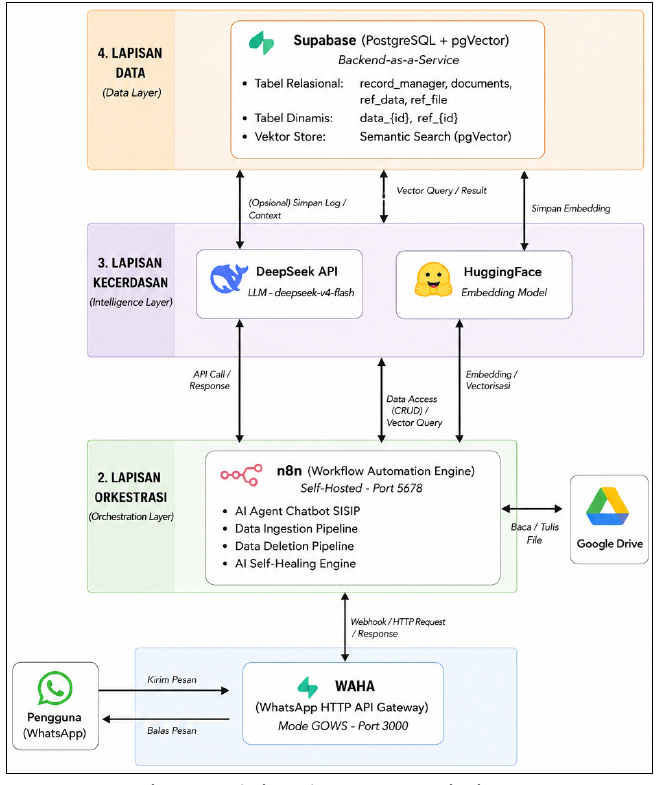
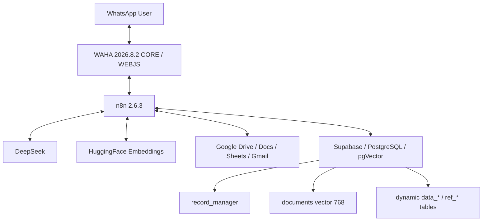

# Architecture

AI SISIP is structured as four logical layers in the PKL report: interface, orchestration, intelligence, and data. WhatsApp communication is handled through WAHA; n8n orchestrates the workflows; DeepSeek is used for classification/reasoning/diagnosis; HuggingFace provides embedding through the n8n LangChain embedding node; and Supabase/PostgreSQL + pgVector stores metadata, tabular data, text chunks, and embeddings.

The four workflow modules are intentionally modular: AI Agent Chatbot SISIP, Data Ingestion Pipeline, Data Deletion Pipeline, and AI Self-Healing Engine.

## Current supplied runtime topology

The historical figure labels WAHA as GOWS. The supplied current runtime explicitly identifies WAHA 2026.8.2 CORE using WEBJS; this repository runtime follows the supplied current environment. See `known-differences.md`.
