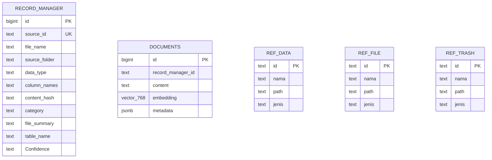

# Database Design and Audit

The public reference migration keeps the five core tables that are required before ingestion: `record_manager`, `documents`, `ref_data`, `ref_file`, and `ref_trash`. Dynamic `data_*` and `ref_*` knowledge tables are created by the ingestion workflow and therefore are not pre-created in the core migration.

## Audited PostgreSQL extensions

The supplied database reported: `pg_graphql 1.5.11`, `pg_net 0.14.0`, `pg_stat_statements 1.10`, `pgcrypto 1.3`, `pgjwt 0.2.0`, `plpgsql 1.0`, `supabase_vault 0.3.1`, `uuid-ossp 1.1`, and `vector 0.8.0`. Only `vector` is declared as an AI SISIP core migration requirement; the rest belong to/are managed by the Supabase environment.

## RAG function

The schema-only dump contains `public.match_documents(query_embedding, match_count, filter)`, which orders `documents` by pgVector cosine distance and returns a similarity score `1 - distance`.

## RLS automation

The supplied database had RLS enabled on all audited public tables. A custom database-level event trigger named `ensure_rls` calls `rls_auto_enable()` on `ddl_command_end` for `CREATE TABLE`, `CREATE TABLE AS`, and `SELECT INTO`, enabling RLS automatically for new public tables. Other event triggers returned by the audit belong to Supabase/PostgREST/GraphQL internals and are not recreated manually in AI SISIP migrations.

## Vector index finding

The audited index list contained only the `documents_pkey` index for `documents`; no HNSW or IVFFlat index was present on `documents.embedding`. The production-derived snapshot is left unchanged. `database/optional/enable-hnsw.sql` is clearly marked as an optional reference enhancement, not as a claim about the audited runtime.
