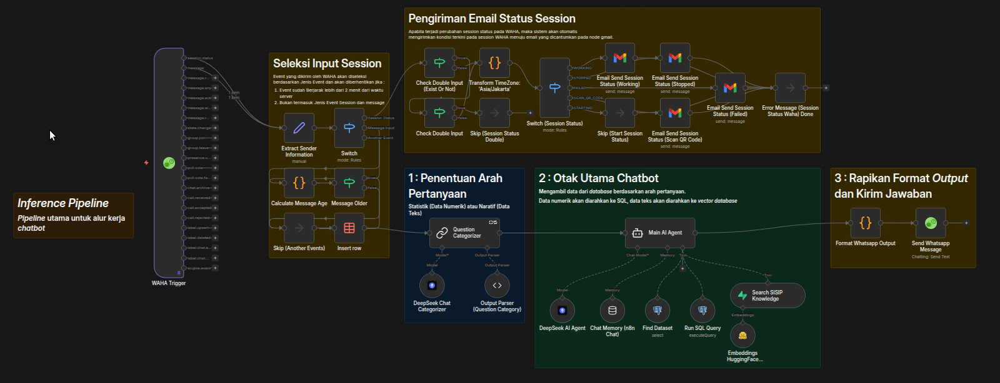
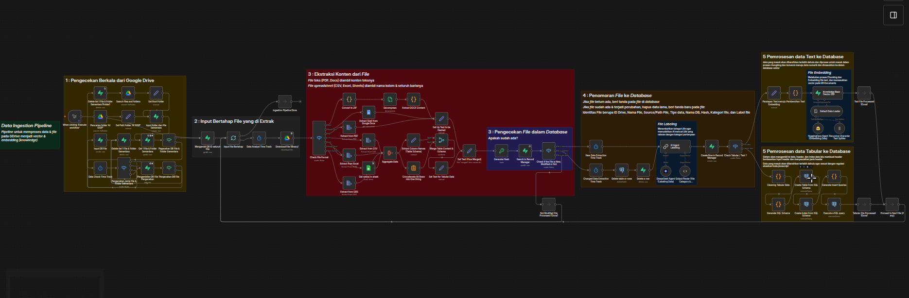
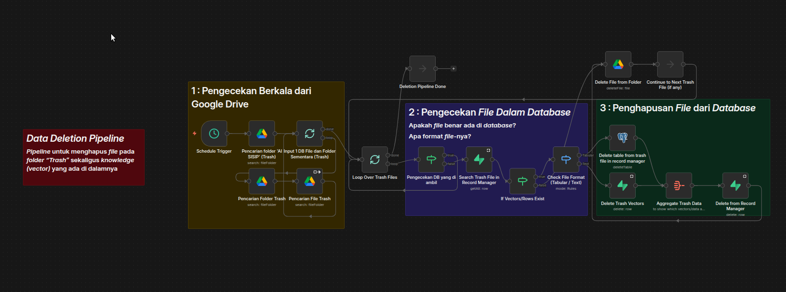
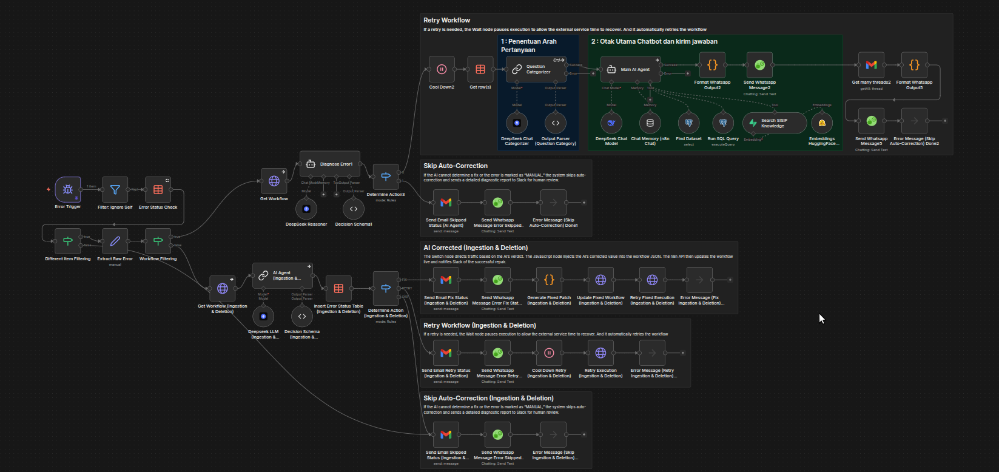

# Workflow Documentation

## 1. AI Agent Chatbot SISIP

The main event-driven WhatsApp pipeline receives WAHA events, distinguishes message and session-status events, extracts sender/session/message data, computes message age, skips stale messages over 120 seconds, classifies the user query, routes it through the Main AI Agent, and formats/sends the answer back through WAHA. The agent has SQL-oriented tools (`Find Dataset`, `Run SQL Query`) and a vector retrieval tool (`Search SISIP Knowledge`). Session-status branches send administrator notifications.

## 2. Data Ingestion Pipeline

This periodic workflow scans a configured Google Drive root, synchronizes temporary file/folder references, processes supported files, performs SHA-256 content change detection, labels new/modified data with AI, stores metadata in `record_manager`, then routes text to chunking/embedding/vector storage and tabular data to dynamic SQL-schema/table generation. Supported formats described in the report include DOCX, Google Docs, PDF, CSV, XLSX, Google Sheets, and ODS.

## 3. Data Deletion Pipeline

This scheduled pipeline inspects the Drive Trash area, verifies the source in `record_manager`, detects whether the source is text or tabular, deletes related vector chunks or the dynamic table, removes metadata, and finally removes the corresponding Drive file according to the workflow sequence.

## 4. AI Self-Healing Engine

The centralized n8n Error Trigger extracts failure details, filters self/duplicate events, branches by failed workflow type, obtains workflow configuration, uses DeepSeek-based diagnosis, and selects FIX / RETRY / SKIP behavior. In the ingestion/deletion FIX branch it can generate a patch, call the n8n API to update the workflow, and retry execution. Notification paths use email and WAHA.

### Public-template safety

The public Self-Healing export is inactive. Credential references and hardcoded n8n API tokens were removed. The n8n API key is referenced through `$env.N8N_API_KEY` where a hardcoded token existed in the supplied export.
